# OpenAI-Proxy-Api

## API Proxy

> ⚠️ 由于腾讯云自身规则，虽然代码本身支持SSE，但部署为云函数后可能无法正常工作
① 进入[云函数创建面板](https://console.cloud.tencent.com/scf/list-create?rid=5&ns=default&createType=empty)，选择日本/新加坡/美国(建议不要使用~~中国香港~~)、web函数、NodeJS 16。
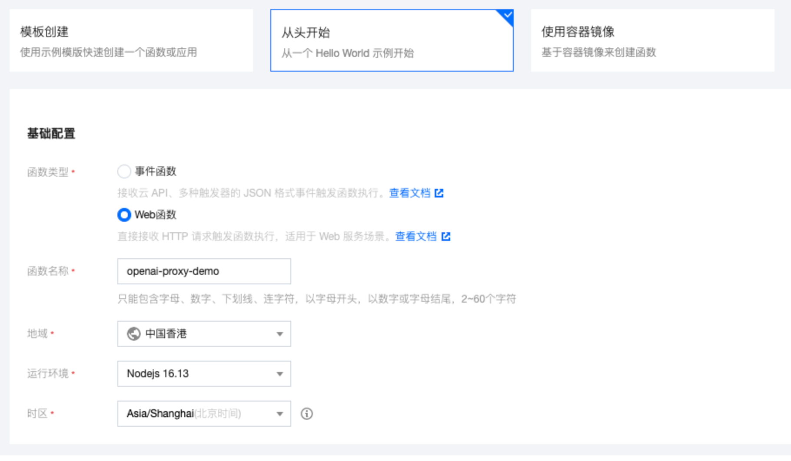  

② 在函数代码处点击`event.js`将本项目 [event.js](/event.js) 的代码粘贴进去。
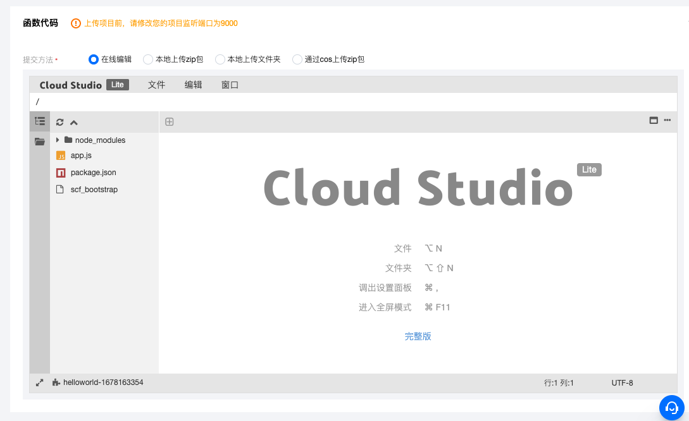  

其他不用改，点创建。

③ 创建完成后，点击「函数管理」→「函数代码」。等编辑器把函数代码加载完成后 CloudStudio → 终端 → 新终端，打开一个新终端。
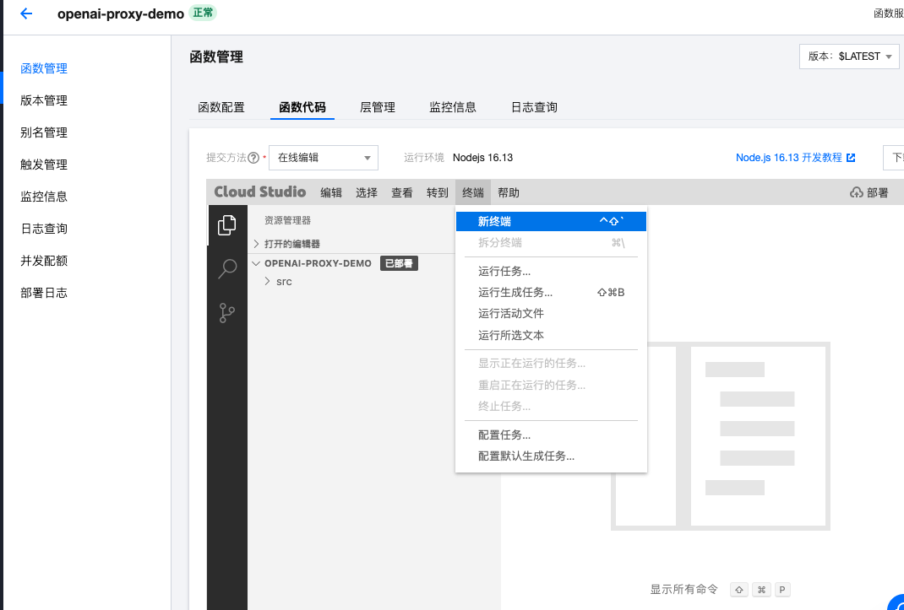  

④ 在出现的终端中粘贴以下代码 

```bash
cd src && yarn add body-parser@1.20.2 cross-fetch@3.1.5 eventsource-parser@0.1.0 express@4.18.2 multer@1.4.5-lts.1 tencentcloud-sdk-nodejs@4.0.567 cors@2.8.5
```
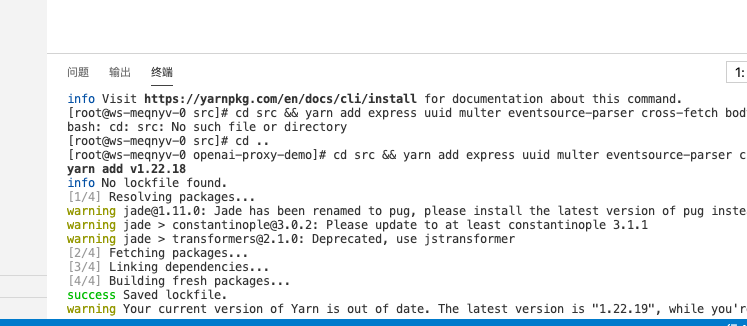  

⑤ 点编辑器右上角的「部署」，等待部署完成。
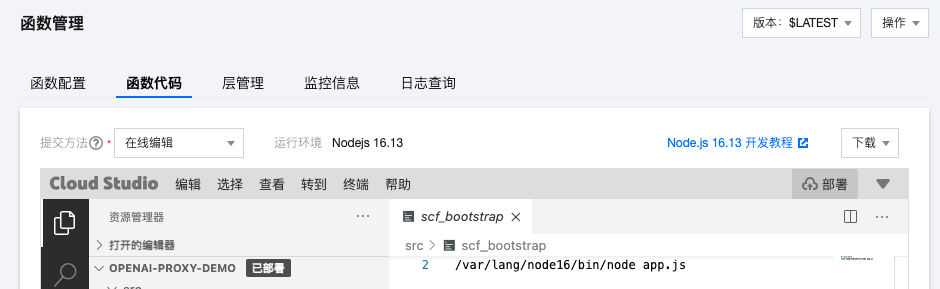  

⑥ 下拉或者进入「触发管理」可以看到云函数的访问地址。
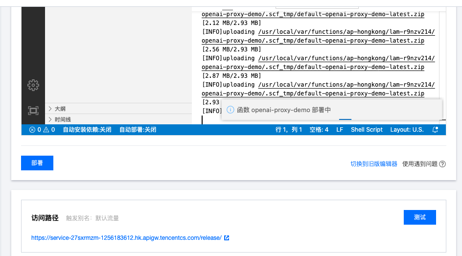  

⑦ 调整函数执行超时时间，默认的3s会经常超时，建议调整为30s；同时添加环境变量 `TIMEOUT`(单位为毫秒，如30000)
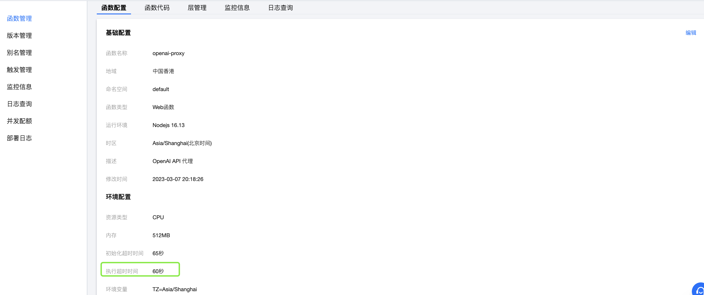  
⑧ 如果你想绑定自己的域名，需要在「触发管理」中开启「标准API网关」，按腾讯云教程进行配置。
## Proxy的使用

使用时将 `https://api.openai.com/` 替换为该路径即可，如 `https://api.openai.com/v1/chat/completions` 替换为 `https://xxxxx.apigw.tencentcs.com/release/v1/chat/completions`

## Feishu-ChatGPT
### 1. 创建一个飞书开放平台应用，并获取到 APPID 和 Secret

访问 [开发者后台](https://open.feishu.cn/app?lang=zh-CN)，创建一个名为 **ChatGPT** 的应用，并上传应用头像。创建完成后，访问【凭证与基础信息】页面，复制 APPID 和 Secret 备用。
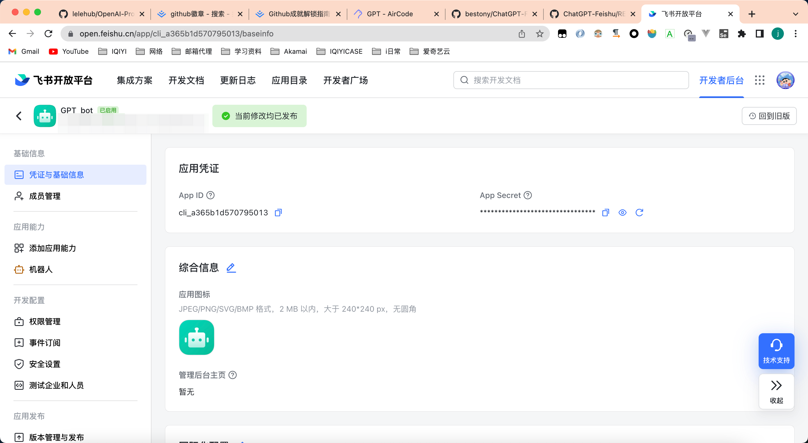  

### 2. 开启机器人能力

打开应用的机器人应用功能

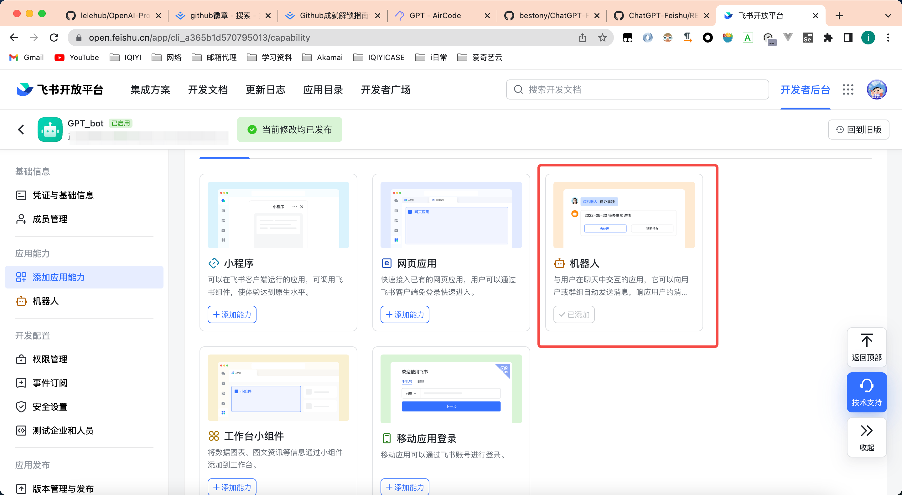  

### 3. 访问 [AirCode](https://aircode.io/dashboard) ，创建一个新的项目

登录 [AirCode](https://aircode.io/dashboard) ，创建一个新的 Node.js v16 的项目，项目名可以根据你的需要填写，可以填写 ChatGPT

  

### 4. 复制本项目下的 event.js 的源码内容，并粘贴到 Aircode 当中

访问[app.js](/app.js)，复制代码

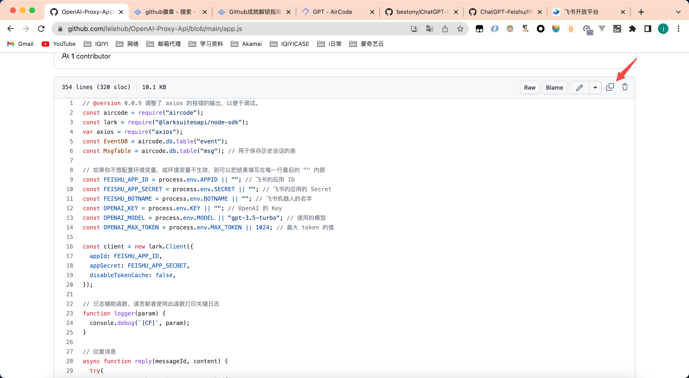  


并把代码粘贴到 AIrcode 默认创建的 hello.js 。然后点击顶部的 deploy ，完成第一次部署。

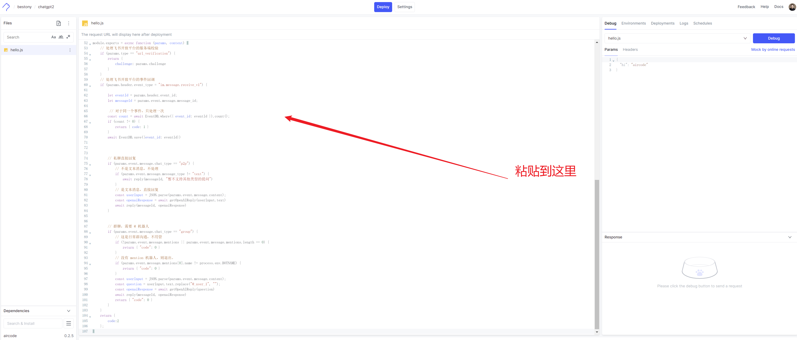  


部署成功后，可以在下方看到。

### 5. 安装所需依赖

这个开发过程中，我们使用了飞书开放平台官方提供的 SDK，以及 axios 来完成调用。点击页面左下角的包管理器，安装 `axios` 和 `@larksuiteoapi/node-sdk`。安装完成后，点击上方的部署，使其生效。

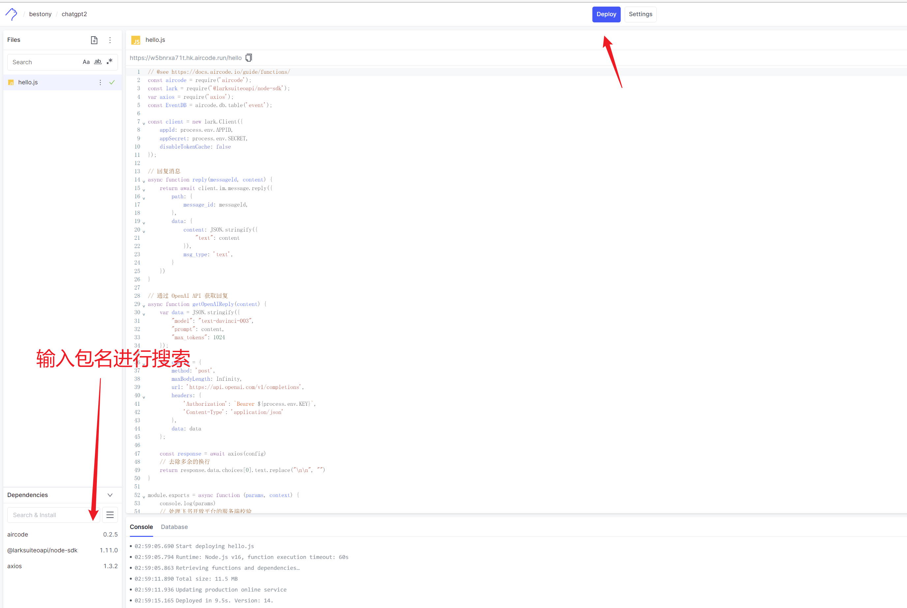  


### 6. 配置环境变量

接下来我们来配置环境变量，你需要配置三个环境变量 `APPID` 、`SECRET` 和 `BOTNAME`，APPID 填写你刚刚在飞书开放平台获取的 APPID，SECRET 填写你在飞书开放平台获取到的 SECRET，BOTNAME 填写你的机器人的名字。

> 配置环境变量可能会失败，可以多 deploy 几次，确保配置成功。

配置完成后，点击上方的 **Deploy** 按钮部署，使这些环境变量生效。

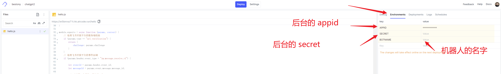  


### 7. 开启权限并配置事件

访问开放平台页面，开通如下 6 个权限：

- im:message
- im:message.group_at_msg
- im:message.group_at_msg:readonly
- im:message.p2p_msg
- im:message.p2p_msg:readonly
- im:message:send_as_bot

然后回到 AirCode ，复制函数的调用地址。
然后回到事件订阅界面，添加事件。

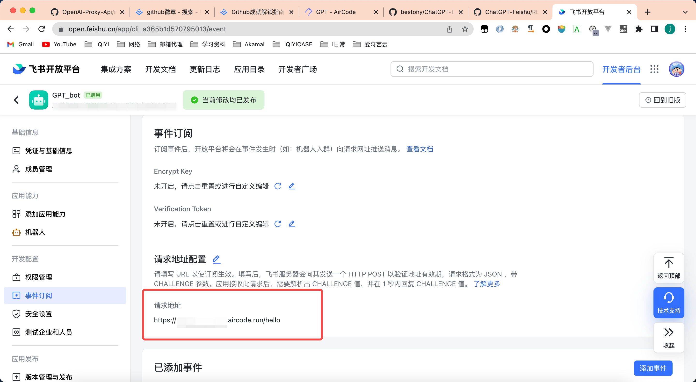  

### 8. 发布版本，等待审核

上述这些都配置完成后，你的机器人就配置好了，接下来只需要在飞书开放平台后台找到应用发布，创建一个全新的版本并发布版本即可。

## 如何贡献？

欢迎通过 issue 提交你的想法，帮助我迭代这个项目 or 直接通过 Pull Request 来提交你的代码。发布成功后，你就可以在飞书当中体验 ChatGPT 了。


## 发布历史

### 1.0.0

- 初版发布。